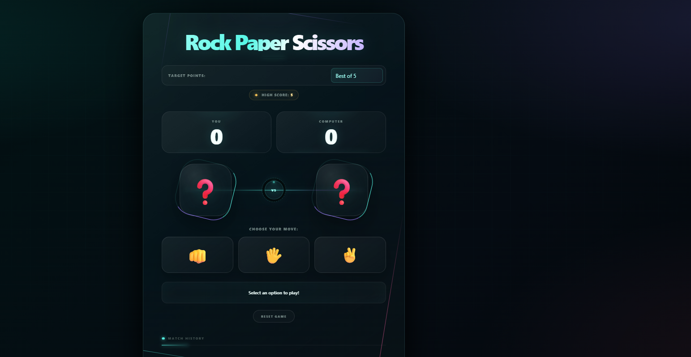

# 🪨 Rock Paper Scissors Game

A responsive and interactive **Rock Paper Scissors** game built with **HTML, CSS, and JavaScript**. Play against the computer, track your score, choose different game modes, and review your match history.

## 📸 Screenshot



## 🎮 Features

* 🪨 Rock, 📄 Paper, and ✂️ Scissors gameplay
* 🤖 Computer opponent with random moves
* 🏆 Multiple game modes:

  * Endless
  * Best of 3
  * Best of 5
* 📊 Player and computer score tracking
* 🏅 High score system
* 📜 Match history
* 🔄 Reset game functionality
* 📱 Responsive design
* ⚡ Interactive game interface

## 🛠️ Technologies Used

* **HTML5** — Structure and content
* **CSS3** — Styling, layout, and responsive design
* **JavaScript** — Game logic, score tracking, game modes, and interactions

## 📂 Project Structure

```text
Rock-Paper-Scissors-Game/
│
├── index.html
├── style.css
├── script.js
├── screenshot.png
└── README.md
```

## 🎯 Game Modes

| Mode      | Description                             |
| --------- | --------------------------------------- |
| Endless   | Continue playing without a target score |
| Best of 3 | First player to reach 3 points wins     |
| Best of 5 | First player to reach 5 points wins     |

## 🚀 How to Run Locally

1. Clone the repository:

```bash
git clone https://github.com/muhammadahmad152/rock-paper-scissors-game.git
```

2. Open the project folder.

3. Open `index.html` in your browser.

## 🎮 How to Play

1. Select a game mode.
2. Choose **Rock**, **Paper**, or **Scissors**.
3. The computer will automatically choose its move.
4. The winner of the round is determined by the standard Rock Paper Scissors rules.
5. Track your score and match history.
6. Use **Reset Game** to start over.

## 📌 Future Improvements

* Add sound effects
* Add animations for each round
* Add difficulty levels
* Add player names
* Add persistent high scores using Local Storage
* Add multiplayer mode
* Improve accessibility features

## 👨‍💻 Author

**Muhammad Ahmad Khan**

Aspiring Software Engineer | Web Development | Future Cyber Security & AI Professional

## 📄 License

This project is created for learning and portfolio purposes.
